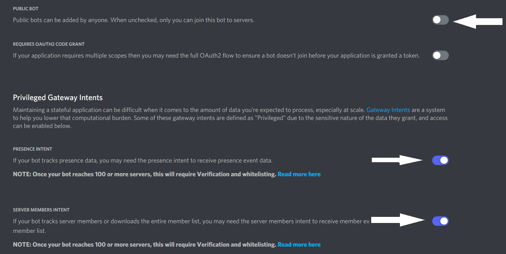

# R7 - Rainbow 7

>### *This project is not meant for breaking ToS of Discord and more aimed at following said Discord ToS _While_ being creative.*

## **SelfHosting**:
-  **Step One:** Read and make sure you know what ratelimits are and what discord set.

-  **Step Two:** Refer to step one again...

-  **Step Three:** Subscribe to the OG Developer, [MrBuzzYT](https://www.youtube.com/MrBuzzMods), Youtube and comment "Thank you" on the vids related to this. (cos I don't like those credit thieves even though i didnt make this alone at all.)

-  **Step Four:** Make sure NPM is installed and NodeJS @ v14.x, if you don't know how to do this, [here's how](https://lmgtfy.app/?q=how+to+install+nodejs+and+npm);

-  **Step Five:** Install the packages in package.json with `npm i`;

-  **Step Six:** Create a bot application and copy its token and paste into `example-config.json` and rename it to `config.json` as well as modifying other settings to your liking ***EXCEPT*** Interval. This is for your and discords api protection. (30 minute waits are worth it in the long run... trust me.)

-  **Step Seven:** Make sure you set your bot to **PRIVATE** in the Discord Developer bot settings and enable both intent swithches (Just for the `members` command to show correctly);

-  **Step Eight:** open a terminal or whatever shell you have to run commands in and run `npm start` in the same directory as the files in this repo.